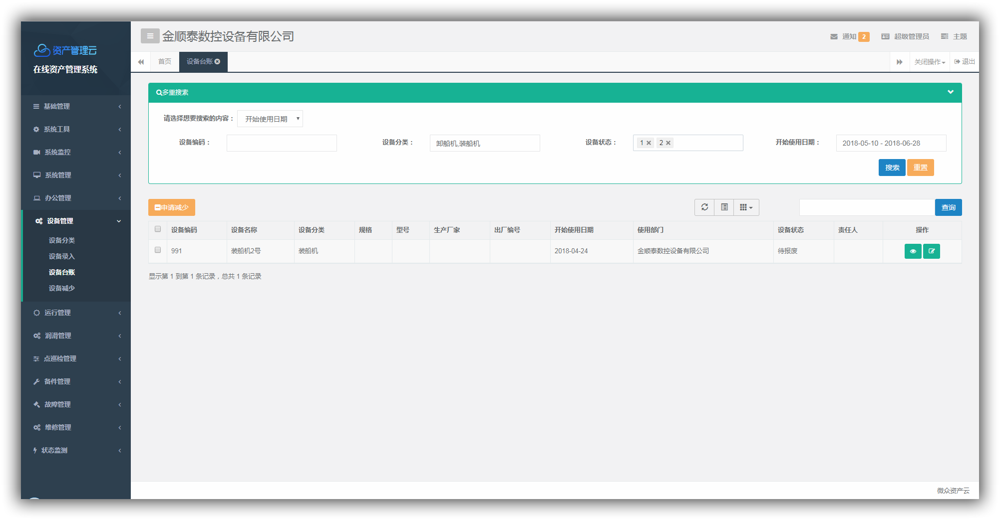
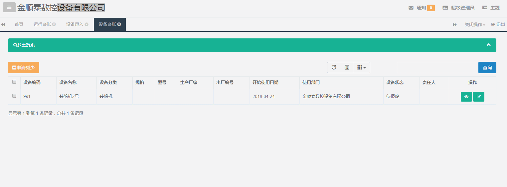

# AiSearch 插件的使用手册 v1.0
@(🗃 文档编辑)[Bootstrap, jQuery, CSS]
**AiSearch** 是通过后台对字段指定类型，将`字段`与`字段类型`传输到前端，前端对字段类型进行判断，从而绑定相应的控件，然后用户录入信息，将信息以 FormData json对象的形式传递。需绑定以下控件：
- **普通文本框**  ：标识符「input」
- **日期控件**  ：标识符「date」，更新 Laydate 插件「2018版，系统为2014旧版」，调用 Laydate 的方法变化，具体可访问[官网](http://www.layui.com/laydate/)

```javascript
<script>
//执行一个laydate实例
laydate.render({
  elem: '#test1' //指定元素
});
</script>
```

- **多选下拉框**  ：标识符「select」，chosen-select
- **分类树**  ：标识符「tree」，zTree

-------------------

[TOC]
## 1. 使用方法
> 1. 在 include.html 公共文件中引入 CSS 文件
> ``` html 
<!-- AiSearch -->
    <link href="/css/AiSearch.css" th:href="@{/css/AiSearch.css}" rel="stylesheet">
 ```
 
> 2.  在 include.html 公共文件中引入 JS 文件
> ``` html 
	<!-- AiSearch -->
	<script type="text/javascript" src="../js/AiSearch.js" th:src="@{/js/AiSearch.js}"></script>
 ```
 
> 3. 调用方法
> 将此 JS 文件置于末尾
> ``` javascript
	<!-- AiSearch -->
	$('.ibox-body').AiSearch();  // 指定元素,便可在其内部起始位置添加搜索插件
 ```
 
## 2.关于插件的配置项代码详解


``` javascript
/*
 * @Description: 基于 Bootstrap 的高级搜索
 * @Author: Founderinxx 
 * @Date: 2018-04-25 18:32:00 
 * @Last Modified by: Founderinxx
 * @Last Modified time: 2018-05-09 10:18:18
 */
// 公共 JS
// 获取下拉框内的字段的 url
var pickUrl;
var treeVal;
var formData = {};
// 引入分类树
$('.ibox').on('click','.eqTypeName',function(){
	treeVal = $(this);
	layer.open({
		type:2,
		title:"选择分类",
		area : [ '300px', '450px' ],
		content:contpath+"equip/eqType/typeTreeView"
	})
});

// 分类树多选
// treeVal 是通过 layer 的 parent 传递过来的
function loadEqType(treeVal,result){
	//$("#eqType").val(typeId);
	// 重置文本框
	treeVal.val('');
	// 选中的节点数为1
	if(result.length == 1){
		treeVal.val(result[0].text);
	}else{
		// 选中的节点数若大于1，用','将字符分隔
		for(var i = 0;i<result.length;i++){
			var selectAll = result[i].text;
			for(var j = 0;j < i;j++){
				selectAll = treeVal.val() + ',' + result[i].text;
			}
			treeVal.val(selectAll);
		}
	}
}

// 主方法
;(function($){  
    $.fn.extend({  
        "AiSearch":function(){
    		// 启用  AiSearch 搜索插件
        	var complete = this;
    		AiSearch(complete);	
        	function AiSearch(complete){
        		// 定义收缩面板	
        		var AiSearchPanel = '';
        		AiSearchPanel += '	<div class="AiSearch"> \
        									<div class="panel panel-primary"> \
        										<a id="collapse" data-toggle="collapse" href="#collapseExample" aria-expanded="false" aria-controls="collapseExample"> \
		        									<div class="panel-heading" style="overflow:hidden"> \
		        										<div class="columns pull-left col-md-2 nopadding"> \
		        											<div class="panel-title"><i class="fa fa-search" aria-hidden="true"></i>多重搜索</div> \
		        										</div> \
		        										<div class="pull-right nopadding"> \
	        									  			<span class="glyphicon glyphicon-chevron-up" aria-hidden="true"> \
	        									  			</span> \
		        										</div> \
		        									</div> \
        										</a> \
	        									<div class="panel-body collapse" id="collapseExample"> \
	        										<div class="col-md-3"> \
	        											<div class="form-inline"> \
	        									  			<label class="control-label">请选择想要搜索的内容：</label> \
	        												<select data-placeholder="选择类别" class="form-control chosen-select colName-select"> \
        														<option value="">选择搜索类别</option>';
        		//$.post(pickUrl,function(result){												
	        		var result = [['name', '姓名', 'input'], ['sex', '性别', 'select'], ['start', '日期', 'date'],['dept', '部门', 'tree']];
	        		$.each(result, function(i, item) {
	        			AiSearchPanel += '<option value="'+item[0]+'" dataType="'+item[2]+'">'+item[1]+'</option>';
	        		});
        		//});
        		
        		AiSearchPanel += '		</select> \
									</div> \
								</div> \
								<form class="form-horizontal"> \
									<div class="columns col-sm-12 nopadding search-box"> \
										<div class="form-group"></div> \
										<div class="btn-group"> \
											<div class="form-inline"> \
											  <button id="submit-btn" type="button" class="btn btn-success">搜索</button> \
											  <button id="reset-btn" type="button" class="btn btn-warning">重置</button> \
											</div> \
										</div> \
									</div> \
								</form> \
						  	</div> \
					  	</div> \
					</div>'	;
        		// 加载收缩面板,加载到 .ibox-body 内起始位置
        		complete.prepend(AiSearchPanel);	
        		
        		// 收缩面板
        		$('#collapse').click(function(){
        			if($('#collapse').attr('aria-expanded') == 'false'){
        				$('#collapse span').removeClass('glyphicon-chevron-up').addClass('glyphicon-chevron-down');							
        			}else{
        				$('#collapse span').removeClass('glyphicon-chevron-down').addClass('glyphicon-chevron-up');							
        			}
        		})       		
        	    
        	    // 下拉框内容改变时触发
        	    $('.colName-select').change(function(){
        	    	var pick = $('.colName-select option:selected').val();
        	    	var dataType = $('.colName-select option:selected').attr('dataType');
        	    	// 当下拉框中的值不为空时
        	        if(pick != ''){
        	            var pickName = $('.colName-select option:selected').text();
        	        	if(dataType == 'tree'){
        	        		// 分类树
        	        		var tree = '<div class="col-sm-3"><label class="col-sm-4 control-label" data-code='+pick+' data-type="tree">'+pickName+'：</label><div class="col-sm-8 input-delete"><input class="form-control eqTypeName" type="text" placeholder="设备分类"><div class="mybtn btn-minus"><i class="fa fa-minus" aria-hidden="true"></i></div></div></div>';
        	        		$('.search-box .form-group').append(tree);
        	        	}else if(dataType == 'date'){
        	        		// 日期控件
        	        		var date = '<div class="col-sm-3"><label class="col-sm-4 control-label" data-code='+pick+' data-type="date">'+pickName+'：</label><div class="col-sm-8 input-delete"><input class="form-control input-date" type="text" placeholder="开始 到 结束"><div class="mybtn btn-minus"><i class="fa fa-minus" aria-hidden="true"></i></div></div></div>';
        	        		$('.search-box .form-group').append(date);        		
        	        		// Laydate 日期格式化
        	        		laydate.render({
        	        			  elem: '.input-date',
        	        			  range: true
        	    			}); 
        	        	}else if(dataType == 'select'){
        	        		// 多选下拉框
        	        		var select = '<div class="col-sm-3"><label class="col-sm-4 control-label" data-code='+pick+' data-type="select">'+pickName+'：</label><div class="col-sm-8 input-delete"><select data-placeholder="选择搜索类别" class="chosen-select form-control choses" multiple><option value="1">1</option><option value="2">2</option></select><div class="mybtn btn-minus"><i class="fa fa-minus" aria-hidden="true"></i></div></div></div>';
        	        		$('.search-box .form-group').append(select);
        	        		$(".choses").chosen();
        	        	}
        	        	else if(dataType == 'input'){
        	        		// 文本框
        	        		 var input = '<div class="col-sm-3"><label class="col-sm-4 control-label" data-code='+pick+' data-type="input">'+pickName+'：</label><div class="col-sm-8 input-delete"><input class="form-control" type="text"><div class="mybtn btn-minus"><i class="fa fa-minus" aria-hidden="true"></i></div></div></div>';
        	        		$('.search-box .form-group').append(input);
        	        	}
        	        }
        	    }); 

        	    // 移除所选的控件
        	    $('.search-box').on('click','.btn-minus',function(){
        	    	$(this).parent().parent().remove();	
        	    });

        	    // 点击按钮，提交数据
        	    $('#submit-btn').click(function(){
        	        // 数据获取
        	    	var inputNum = $('.form-horizontal label').length;
        	    	// 判断控件类型，以 formData json对象的形式传递到表格中
        	    	for(var i=0;i<inputNum;i++){
            	    	var type = $('.form-horizontal label').eq(i).data('type');
        	    		var field = $('.form-horizontal label').eq(i).data('code');
        	    		if(type == 'input' || 'date'){  
        	    			formData[field] = $('.form-horizontal .input-delete').eq(i).children().val();
        	    		}else if(type == 'select'){
        	    			var myStr = $('.form-horizontal .input-delete').eq(i).children().val().join("-");
        	    			formData[field] = myStr;
        	    		}else if(type == 'tree'){
        	    			var myStr2 = $('.form-horizontal .input-delete').eq(i).children().val().split(",").join("-");
        	    			formData[field] = myStr2;
        	    		}
        	    	}
        	    	// 传递对象
        	    	load(formData);
        	    	// 重载表格
        	    	reLoad();
        	    });
        	    
        	    // 重置数据
        	    $('#reset-btn').click(function(){
        	    	$('.form-horizontal .input-delete').children().val('');
        	    	// chosen-select 重置
        	    	$('.form-horizontal .chosen-select').val('');
        	    	$('.form-horizontal .chosen-select').trigger('chosen:updated');
        	    })
        	}
        }  
    });  
})(jQuery); 
```
## 3. 效果演示



## 4. 注意事项
 - 日期 Laydate 已更新至 2018 版本，系统内 2014 版需更新
 - 在 typeTree.js 中作对应修改相应的 JS 让分类树绑定对应的文本框，所选值投射到文本框中
``` javascript
<script type="text/javascript">
	$(document).ready(function() {
		getTreeData()
	});
	function getTreeData() {
		$.ajax({
			type : "GET",
			url : contpath+"equip/eqType/tree",
			success : function(tree) {
				loadTree(tree);
			}
		});
	}
	function loadTree(tree) {
		$('#typeTree').jstree({
			'core' : {
				'multiple': false, // 单选和复选
				'data' : tree
			},
		    'checkbox' : {
		        // "keep_selected_style": false, // 是否默认选中
		        // "tie_selection": false,
                "three_state": false // 父子级别级联选择
		      },
			"plugins" : [ "search","checkbox"]
		});
		$('#typeTree').jstree().open_all();
	}
	
	// 点击按钮提交分类树选中节点
	$('#btn-tree').on('click',function(){
		var result = [];
        // 获取所有的已经选中的节点信息，如果要获得全部信息则需要开启：full:true，直接调用get_checked()，则只可以获取节点的id
 	    var checkedVal = $('#typeTree').jstree(true).get_checked([{full:true}]);
 	    for(var i = 0;i<checkedVal.length;i++){
 	    	// 将节点的id和text属性值对应放到数组中
 	    	result.push({id:checkedVal[i].id,text:checkedVal[i].text});	
 	    }
 	    parent.loadEqType(parent.treeVal,result); // 捕获parent.treeVal，即点击的文本框
 	    var index = parent.layer.getFrameIndex(window.name); // 获取窗口索引
		parent.layer.close(index); //关闭窗口
	});
</script>
```
	
> - 该插件暂仅适用于本项目，同时还不够完善，仍有诸多要与后台人员配合的内容，大家有相关问题可与我积极讨论。

## 5. 反馈与建议
- 作者：[@方正]()
- 邮箱：<founderinxx@icloud.com>

